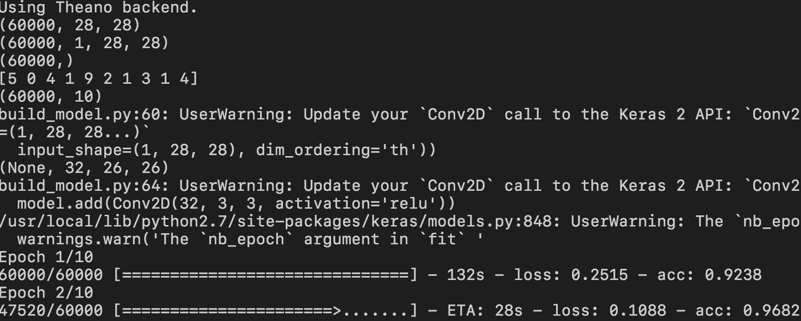
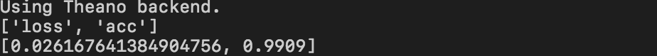
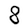
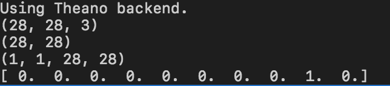

# Tutorial: Building a Convolutional Neural Network (CNN) with Keras

#### Estimated Time: 60mins

This tutorial is adapted from [this tutorial](https://elitedatascience.com/keras-tutorial-deep-learning-in-python) by EliteDataScience

#### The goal is to give you a basic understanding of building and testing an ML model using Python, Keras, Theano backend.

### In this tutorial you'll briefly get familiar with the following technologies:

* [Keras](https://keras.io/)
* [Theano](https://github.com/Theano/Theano)

**NOTE:** All of the code for this tutorial is included in this repo.

**NOTE: I highly recommend copying the code found in this tutorial line by line in order to understand exactly what each line of code does. That's why I've split the code the way I did, in more modular chunks.**

## Prerequisites
* [Python](https://www.python.org/) - Tested on 2.7 (but 2.7+ should work)
* [PIP](https://pip.pypa.io/en/stable/installing/)
* [VSCode](https://code.visualstudio.com/)
* **Knowledge of install python dependencies** - as you run the code below some modules needed may not already be part of your python environment and so you'll need to install the modules to continue.

### Setting up your environment: [Follow this tutorial](https://elitedatascience.com/keras-tutorial-deep-learning-in-python#step-1)


## Table of Contents:

* [Build a Model](#build-a-model)
* [Evaluate the Model](#evaluate-the-model)
* [Use the Model](#use-the-model-to-make-predictions)

## Build a Model

* Install opencv `numpy` `h5py` `keras` - if you haven't already

```sh
> pip install numpy h5py keras
```

* Open `VSCode`
* Create a project directory
* Create file `build_model.py`

```py
import h5py # lib needed to save the model
import numpy as np
np.random.seed(123)
```

```py
# keras model module
from keras.models import Sequential
# keras core layers
from keras.layers import Dense, Dropout, Activation, Flatten
# keras CNN layers
from keras.layers import Conv2D, MaxPooling2D
# keras utils
from keras.utils import np_utils
```

```py
# load MNIST dataset
from keras.datasets import mnist

# load pre-shuffled MNIST data into train and test sets
(Xtrain, Ytrain), (Xtest, Ytest) = mnist.load_data()

# examine training data's dimensions: (60000, 28, 28)
print Xtrain.shape
```

```py
# show image
from matplotlib import pyplot as plt
plt.imshow(Xtrain[0])
plt.show()
```
```py
# transform dataset to having 4 dimensions (#-of-samples, depth, width, height).
Xtrain = Xtrain.reshape(Xtrain.shape[0], 1, 28, 28)
Xtest = Xtest.reshape(Xtest.shape[0], 1, 28, 28)

# examine training data's dimensions: (60000, 1, 28, 28)
print Xtrain.shape
```
```py
# final preprocessing step for the input data is to convert our data type to float32
Xtrain = Xtrain.astype('float32')
Xtest = Xtest.astype('float32')

# and normalize our data values to the range [0, 1].
Xtrain /= 255
Xtest /= 255
```
```py
# examine training data's dimensions
print Ytrain.shape # (60000,)
print Ytrain[:10] # [5 0 4 1 9 2 1 3 1 4]

# Ytrain and Ytest data are not split into 10 distinct class labels, but rather are represented as a single array with the class values.
```

```py
# Convert 1-dimensional class arrays to 10-dimensional class matrices
Ytrain = np_utils.to_categorical(Ytrain, 10)
Ytest = np_utils.to_categorical(Ytest, 10)

print Ytrain.shape
```

```py
# Building model
model = Sequential()
```

```py
# 32: corresponds to the number of convolution filters to use. 
# 3: the number of rows in each convolution kernel.
# 3: and the number of columns in each convolution kernel.
# activation: the type of activation function to use 
# input_shape: dimensions of the inputs: 1 channel, 28 px width, 28 px height
# dim_ordering: tells model to use Theano's dimension ordering
model.add(Conv2D(32, 3, 3, activation='relu',
                 input_shape=(1, 28, 28), dim_ordering='th'))
                 
print model.output_shape
```
* [relu activation function](https://github.com/Kulbear/deep-learning-nano-foundation/wiki/ReLU-and-Softmax-Activation-Functions#rectified-linear-units)

```py
# add more layers to our model
model.add(Conv2D(32, 3, 3, activation='relu'))
```
```py
# MaxPooling2D is a way to reduce the number of parameters in our model by
# sliding a 2x2 pooling filter across the previous layer and taking the
# max of the 4 values in the 2x2 filter
model.add(MaxPooling2D(pool_size=(2, 2)))
```
```
# regularizing our model in order to prevent overfitting
model.add(Dropout(0.25))
```
```
# note that the weights from the Convolution layers must be flattened (made 1-dimensional) before passing them to the fully connected Dense layer.
model.add(Flatten())
model.add(Dense(128, activation='relu'))
model.add(Dropout(0.5))
```
```
# final layer has an output size of 10, corresponding to the 10 classes of digits.
model.add(Dense(10, activation='softmax'))

# compile model
# https://keras.io/losses/
# https://keras.io/optimizers/
model.compile(loss='categorical_crossentropy',
              optimizer='adam',
              metrics=['accuracy'])

# train model
# nb_epoch: number of epochs (iterations) the model will train on the dataset
model.fit(Xtrain, Ytrain, batch_size=32, epochs=10, verbose=1)

# save model
model.save("mnist.h5")
```

* Run `python build_model.py`
* **Note:** Depending on your computing device setup this training can take up to **15 minutes...maybe more**




## Evaluate the Model

* Install opencv `cv2`

```sh
> pip install opencv-python
```

* Create file `eval_model.py`

```py
#import needed modules
from keras.models import load_model
from keras.utils import np_utils
from keras.datasets import mnist
```

```py
# load pre-shuffled MNIST data into train and test sets
(Xtrain, Ytrain), (Xtest, Ytest) = mnist.load_data()

# Prep testing dataset as in the section above
Xtest = Xtest.reshape(Xtest.shape[0], 1, 28, 28)
Xtest = Xtest.astype('float32')
Xtest /= 255
Ytest = np_utils.to_categorical(Ytest, 10)
```

```py
# load model from disk
model = load_model("mnist.h5")

# evaluate model
score = model.evaluate(Xtest, Ytest, verbose=0)

#examine scores
print model.metrics_names
print score
```

* Run `python eval_model.py`




## Use the model to make predictions
* Create file `use_model.py`

```py
import cv2 #opencv module used to manipulate images
from keras.models import load_model
from keras.preprocessing import image

import matplotlib.pyplot as plt
import numpy as np
```

```
# load model
model = load_model("mnist.h5")
```
```py
# read in image
img = image.load_img("./images/8.png")
plt.imshow(img)
plt.show()
```
* **Note:** our test image `"./images/8.png"` is included in this repo
 



```py
# show dimensions
x = image.img_to_array(img)
print x.shape  # (28, 28, 3)
```
```py
# convert image to 1 channel aka gray scale
x = cv2.cvtColor(x, cv2.COLOR_BGR2GRAY)
print x.shape # (28, 28)
```
```py
# convert to 4 dimensions: (nb_samples, nb_channels/depth, width, height)
x = x.reshape(1, 1, 28, 28)
print x.shape
```
```py
# predict
prediction = model.predict(x)
print np.around(prediction[0], decimals=0)
```

* Run `python use_model.py`



* **Note:** the array above are our 10 classes of numbers [0-9]. **The model accurately predicted the image was an 8 as indicated by the 1 (true) in the 8th place (0-indexed).**

### Congratulations!
You've built a deep learning model! You saw how to build a model, evaluate said model, and use it to make predictions. That's all we're going to cover in this but I hope this gave you a better sense for creating ML models.

## Authors

* **Claudius Mbemba** - [User1m](https://github.com/user1m)


## Acknowledgments

* [EliteDataScience](https://elitedatascience.com/keras-tutorial-deep-learning-in-python)
